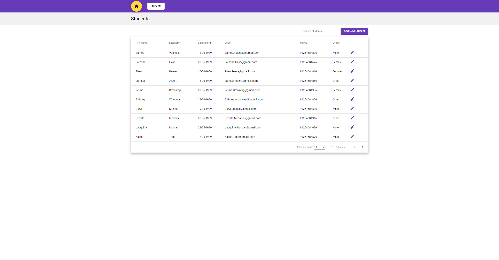
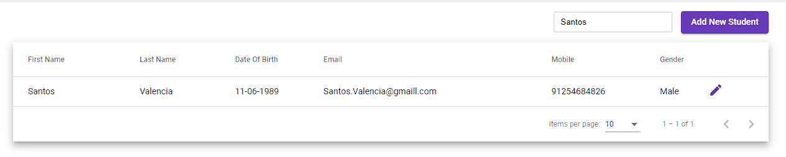
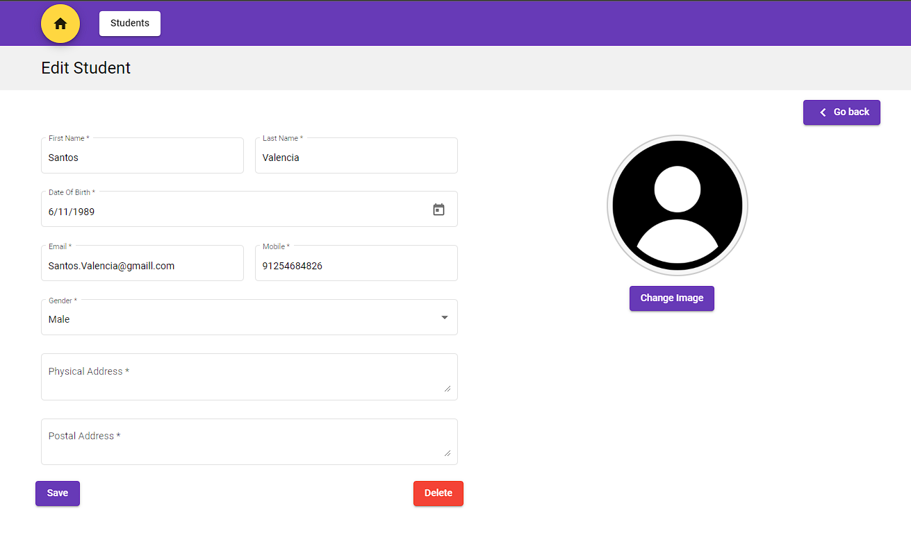
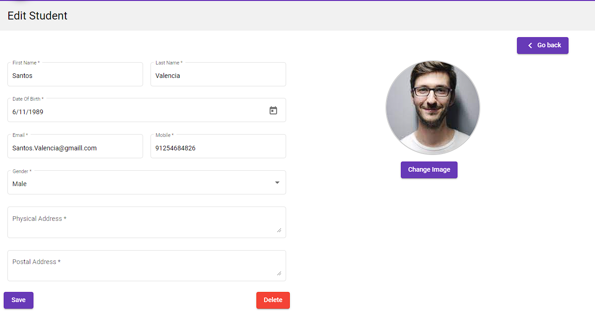
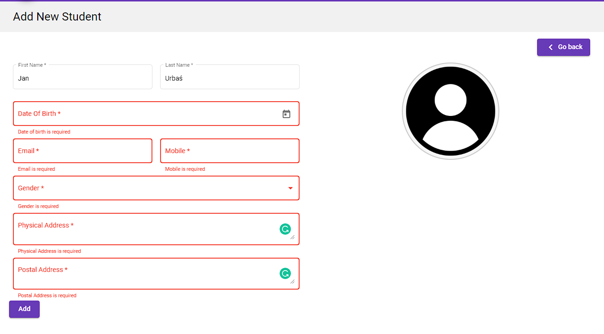

# StudentAdminPortal.UI

## Requirements:
- node.js 
- angular 14.2.9

## Presentation

### Students List

### Searching for student

### Edit Student View

### Editing student with changed profile picture

### Adding new student

